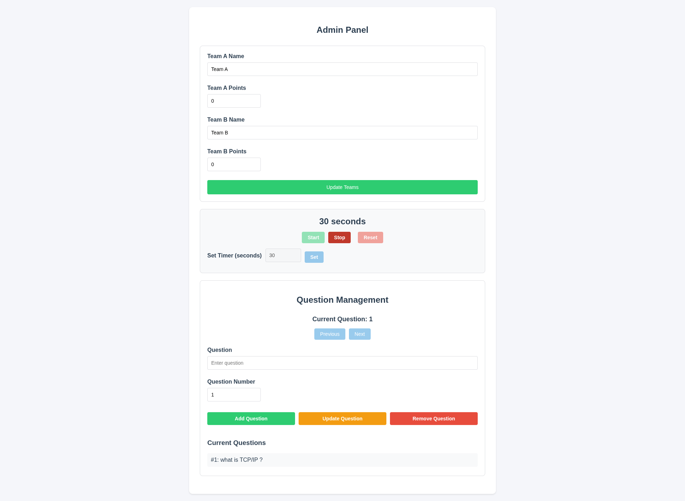
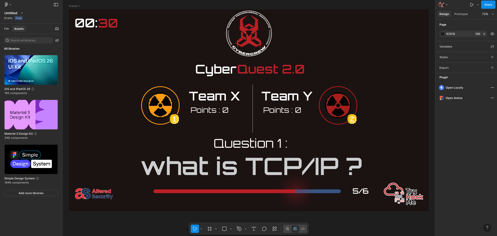

# Cyber Competition

A web application for managing and participating in cyber competitions. This project includes an admin panel for managing events and a user interface for participants.

## Features

- Admin panel for event management
- User interface for competition participation
- Responsive design

## Screenshots

### Admin Panel



### User Interface



## Getting Started

1. Clone the repository:
   ```zsh
   git clone https://github.com/jooexploit/Cyber-Competition-website
   ```
2. Install dependencies:
   ```zsh
   npm install
   ```
3. Start the server:
   ```zsh
   npm start
   ```

## Project Structure

- `server.js` - Main server file
- `public/` - Contains HTML, CSS, and JS for UI and admin panel
- `admin_panel_screen.png` - Screenshot of the admin panel
- `UI_screen.png` - Screenshot of the user interface

## License

MIT

## Usage

After starting the server, open your browser and navigate to `http://localhost:3000` (or the port specified in your environment) to access the user interface. For admin panel access, go to `http://localhost:3000/admin`.

## Contributing

Contributions are welcome! Please fork the repository and submit a pull request. For major changes, open an issue first to discuss what you would like to change.

## Contact

For questions or support, please contact the project maintainer at: [youseftamereg@gmail.com]
